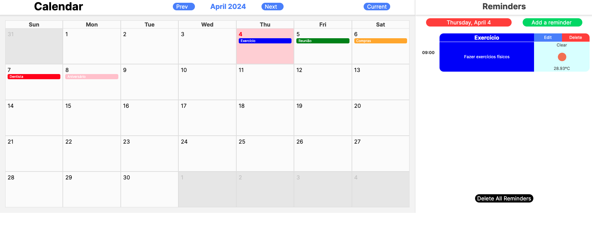

# Calendar Challenge

Bem vindo!

Este é um desafio de programação que tem como objetivo avaliar a qualidade técnica dos candidatos a vagas de desenvolvedor na Opportuna Tecnologia.

## Descrição

A aplicação é um sistema de calendário que permite ao usuário visualizar, criar, editar e excluir lembretes, também possuindo uma integração com a API do [OpenWeatherMap](https://openweathermap.org/).

Algumas funcionalidades do sistema de calendário não estão funcionando corretamente.

Crie um repositório e implemente as funcionalidades que estão faltando:

### Regras obrigatórias

- [X] Poder adicionar lembretes (max 30 chars) incluindo (Dia, Horário e cidade e cor) exemplo ao clicar no botão de editar de algum lembrete já criado;
- [X] Mostrar os lembretes na ordem correta (Dias corretos e horários corretos) ;
- [X] Permitir a navegação do calendário por outros dias, meses, anos;
- [X] Poder editar o lembrete com os dados de (Título, Descrição, Dia, Horário e cidade e cor);
- [X] Teste unitário das funcionalidades de criar novo lembrete
- [ ] Teste unitário das informações de clima da data e horário dos lembretes com base na cidade;

### Regras técnicas

- [X] O CRUD de lembrete deve ser realizado em API (NODE.JS) a ser criada pelo candidato;
- [X] As operações de CRUD dos lembretes devem ser realizadas em banco SQL e não devem ficar somente em estados da aplicação;

### Bônus

- [X] Funcionalidade de deletar todos os lembretes de um dia;
- [X] Criar migration na API para a tabela do BD;

```bash
# Para rodar a aplicação, com Yarn instalado, execute os comandos abaixo:
yarn install
yarn dev
```

Após implementar as funcionalidades, nos envie o link do seu repositório por e-mail (Yuri e Arthur) para que possamos avaliar o seu código.

Caso tenha alguma dúvida, entre em contato conosco.


